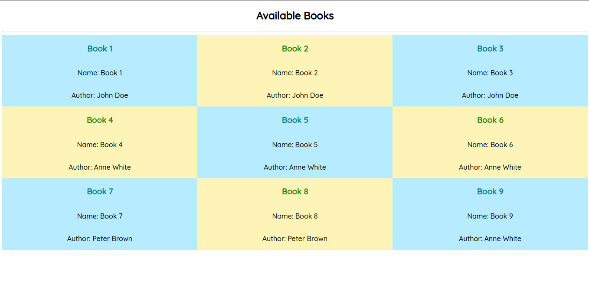

# shiny-graphql

Simple GraphQL server using NodeJS

To run the server, use the following command:

```bash
npm run devql
 ```

Open <a href="https://github.com/Murigi-Nganga/shiny-graphql/blob/main/index.html">index.html</a> in a browser to see a client-side implementation of a GraphQL query

Screenshot:


